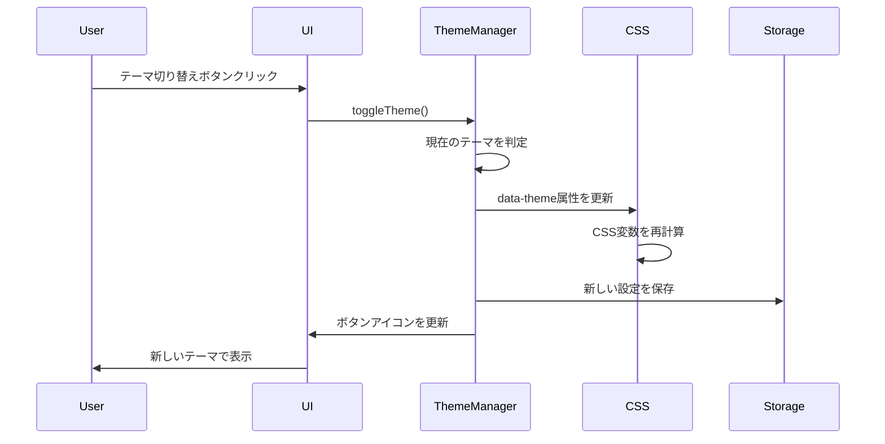
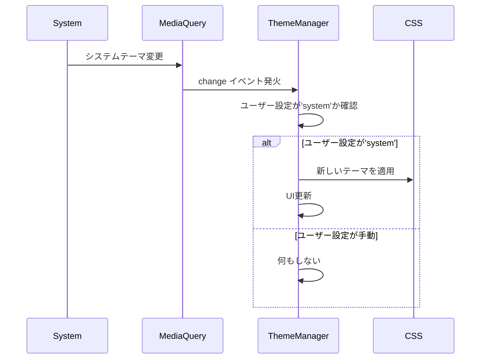

# 設計書

## 概要

ギターチューナーWebアプリケーションに包括的なテーマシステムを実装し、ダークモードとライトモードの切り替え機能を提供する。現代的なCSS技術（CSS Custom Properties、light-dark()関数）とアクセシビリティ標準（WCAG 2.1）に準拠した実装を行い、ユーザーの好みやシステム設定に応じた最適な表示を実現する。

## アーキテクチャ

### システム構成

```
┌─────────────────┐    ┌─────────────────┐    ┌─────────────────┐
│  テーマ検出      │───▶│  テーマ管理      │───▶│   UI更新        │
│ (System/Manual) │    │ (ThemeManager)  │    │ (CSS Variables) │
└─────────────────┘    └─────────────────┘    └─────────────────┘
                              │
                              ▼
                       ┌─────────────────┐
                       │  永続化ストレージ │
                       │ (LocalStorage)  │
                       └─────────────────┘
```

### 技術スタック

- **CSS**: CSS Custom Properties (CSS Variables)、light-dark()関数、prefers-color-scheme
- **JavaScript**: ThemeManager クラス、LocalStorage API、matchMedia API
- **アクセシビリティ**: WCAG 2.1 AA準拠、prefers-reduced-motion対応
- **ブラウザサポート**: モダンブラウザ（Chrome 88+、Firefox 87+、Safari 15.4+）

## コンポーネントと インターフェース

### 1. ThemeManager クラス

テーマの検出、切り替え、永続化を管理

```typescript
class ThemeManager {
  constructor()
  
  // テーマの初期化と検出
  initialize(): void
  private detectSystemTheme(): 'light' | 'dark'
  private loadSavedTheme(): 'light' | 'dark' | 'system' | null
  
  // テーマの切り替え
  setTheme(theme: 'light' | 'dark' | 'system'): void
  toggleTheme(): void
  getCurrentTheme(): 'light' | 'dark'
  getThemePreference(): 'light' | 'dark' | 'system'
  
  // イベント処理
  private onSystemThemeChange(event: MediaQueryListEvent): void
  private applyTheme(theme: 'light' | 'dark'): void
  private saveTheme(preference: 'light' | 'dark' | 'system'): void
  
  // UI更新
  private updateThemeToggleButton(): void
  private updateColorScheme(): void
}
```

### 2. テーマ切り替えUI コンポーネント

```typescript
interface ThemeToggleButton {
  element: HTMLButtonElement
  iconLight: string  // ☀️ または SVGアイコン
  iconDark: string   // 🌙 または SVGアイコン
  
  updateIcon(currentTheme: 'light' | 'dark'): void
  attachEventListener(callback: () => void): void
}
```

### 3. CSS テーマ変数システム

```css
:root {
  /* システム設定に基づく自動テーマ */
  color-scheme: light dark;
  
  /* ライトテーマ（デフォルト） */
  --primary-color: #2c3e50;
  --secondary-color: #3498db;
  --success-color: #27ae60;
  --warning-color: #f39c12;
  --danger-color: #e74c3c;
  --background-color: #ecf0f1;
  --surface-color: #ffffff;
  --text-color: #2c3e50;
  --text-secondary: #7f8c8d;
  --border-color: #bdc3c7;
  --shadow-color: rgba(0, 0, 0, 0.1);
}

/* ダークテーマ */
[data-theme="dark"] {
  --primary-color: #ecf0f1;
  --secondary-color: #3498db;
  --success-color: #2ecc71;
  --warning-color: #f39c12;
  --danger-color: #e74c3c;
  --background-color: #1a1a1a;
  --surface-color: #2c2c2c;
  --text-color: #ecf0f1;
  --text-secondary: #bdc3c7;
  --border-color: #4a4a4a;
  --shadow-color: rgba(0, 0, 0, 0.3);
}

/* 最新のlight-dark()関数を使用した代替実装 */
@supports (color: light-dark(white, black)) {
  :root {
    color-scheme: light dark;
    --primary-color: light-dark(#2c3e50, #ecf0f1);
    --background-color: light-dark(#ecf0f1, #1a1a1a);
    --surface-color: light-dark(#ffffff, #2c2c2c);
    --text-color: light-dark(#2c3e50, #ecf0f1);
    /* 他の色も同様に定義 */
  }
}
```

## データモデル

### テーマ設定データ構造

```typescript
interface ThemeSettings {
  preference: 'light' | 'dark' | 'system';  // ユーザーの設定
  current: 'light' | 'dark';                // 現在適用されているテーマ
  systemTheme: 'light' | 'dark';           // システムのテーマ設定
}

interface ThemeColors {
  primary: string;
  secondary: string;
  success: string;
  warning: string;
  danger: string;
  background: string;
  surface: string;
  text: string;
  textSecondary: string;
  border: string;
  shadow: string;
}
```

### LocalStorage データ構造

```typescript
interface StoredThemeData {
  theme: 'light' | 'dark' | 'system';
  timestamp: number;  // 設定保存時刻
  version: string;    // テーマシステムのバージョン
}
```

## エラーハンドリング

### ブラウザサポートエラー

- CSS Custom Properties未対応ブラウザでのフォールバック
- matchMedia API未対応時の代替処理
- LocalStorage無効時の処理

### テーマ適用エラー

- 不正なテーマ値の処理
- CSS変数の適用失敗時の復旧
- システムテーマ検出失敗時のデフォルト処理

### パフォーマンス考慮

- テーマ切り替え時のレイアウトシフト防止
- CSS変数の効率的な更新
- 不要なDOM操作の削減

## テスト戦略

### 単体テスト

1. **ThemeManager テスト**
   - システムテーマの検出精度
   - テーマ切り替えの動作確認
   - LocalStorageの読み書き処理
   - イベントハンドラーの動作

2. **CSS テーマ テスト**
   - 各テーマでのコントラスト比測定（4.5:1以上）
   - CSS変数の正しい適用確認
   - アニメーション動作の検証

### 統合テスト

1. **テーマ切り替えフロー テスト**
   - 手動切り替え → UI更新 → 永続化の流れ
   - システム設定変更時の自動切り替え
   - ページリロード時のテーマ復元

2. **アクセシビリティ テスト**
   - スクリーンリーダーでのテーマ切り替えボタン認識
   - キーボードナビゲーション対応
   - 高コントラストモード対応

### ブラウザ互換性テスト

1. **モダンブラウザ テスト**
   - Chrome, Firefox, Safari, Edge での動作確認
   - light-dark()関数サポート状況の確認

2. **モバイルブラウザ テスト**
   - iOS Safari, Android Chrome での動作確認
   - タッチデバイスでのテーマ切り替え操作

## アクセシビリティ設計

### WCAG 2.1 AA準拠

1. **コントラスト比要件**
   - 通常テキスト: 4.5:1以上
   - 大きなテキスト: 3:1以上
   - UI要素: 3:1以上

2. **色の使用**
   - 色のみに依存しない情報伝達
   - 色覚異常への配慮

3. **動作・アニメーション**
   - prefers-reduced-motion対応
   - 必須でないアニメーションの無効化オプション

### テーマ切り替えボタンのアクセシビリティ

```html
<button 
  id="theme-toggle"
  aria-label="テーマを切り替え"
  aria-pressed="false"
  title="ダークモード/ライトモードを切り替え"
>
  <span aria-hidden="true">🌙</span>
  <span class="sr-only">現在: ライトモード</span>
</button>
```

## パフォーマンス最適化

### CSS最適化

1. **変数の効率的な使用**
   - 必要最小限の変数定義
   - 継承を活用した階層構造
   - 計算コストの削減

2. **アニメーション最適化**
   - GPU加速の活用（transform, opacity）
   - will-change プロパティの適切な使用
   - アニメーション完了後のクリーンアップ

### JavaScript最適化

1. **イベント処理の最適化**
   - デバウンス処理の実装
   - 不要なイベントリスナーの削除
   - メモリリークの防止

2. **DOM操作の最適化**
   - バッチ処理による更新
   - 仮想DOM的な差分更新
   - レイアウトスラッシングの回避

## セキュリティ考慮事項

### データ保護

- LocalStorageデータの検証
- XSS攻撃からの保護
- CSP（Content Security Policy）への準拠

### プライバシー

- ユーザー設定の適切な管理
- 不要なデータ収集の回避
- GDPR準拠（該当する場合）

## 実装詳細

### テーマ切り替えフロー



### システムテーマ変更検出フロー



## 段階的実装計画

### Phase 1: 基本テーマシステム
- CSS変数の定義とダークテーマの実装
- 基本的なテーマ切り替え機能
- LocalStorageでの設定保存

### Phase 2: 高度な機能
- システムテーマの自動検出
- アニメーション効果の追加
- アクセシビリティ機能の強化

### Phase 3: 最適化と拡張
- パフォーマンス最適化
- 追加テーマオプション（高コントラストなど）
- ユーザビリティの向上

## ブラウザサポート戦略

### モダンブラウザ（推奨）
- CSS Custom Properties完全サポート
- light-dark()関数サポート（Chrome 123+, Firefox 120+）
- 最新機能の積極的活用

### レガシーブラウザ（フォールバック）
- CSS Custom Properties基本サポート
- 従来のメディアクエリベース実装
- 機能の段階的縮退